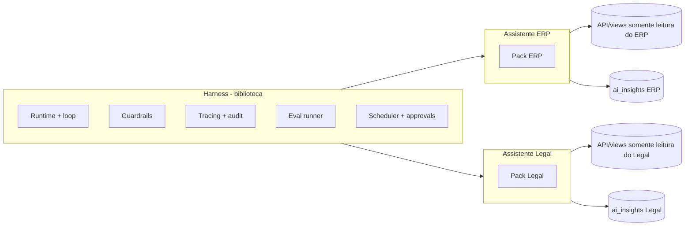

# Guia de Estudo: Harness de IA para ERP e Legal

Sep 23, 2026 · @Someone

## Visão geral

O projeto é uma biblioteca compartilhada (o **harness**) mais dois **packs de domínio** independentes, um para o ERP e outro para o sistema Legal, construídos em partes enquanto você aprende AI Engineering.

O harness cuida do que é comum: chamar o modelo, registrar ferramentas, limitar custo e passos, validar saídas, rastrear e avaliar. Cada pack traz o que é específico: ferramentas, prompts, schemas e testes. Os dois produtos não compartilham dados, credenciais nem deploy; só compartilham código.

|  | ERP | Legal |
| --- | --- | --- |
| Função | Apontar pedidos de reposição de estoque e resumir informações financeiras dos checkouts | Apresentar prazos dos processos e resumir andamentos |
| Quando roda | Jobs agendados (estoque à noite, financeiro de manhã) e perguntas sob demanda | Digest diário, evento de nova movimentação e perguntas sob demanda |
| Regra de ouro | O código calcula, o LLM explica | O sistema de registro define as datas, o LLM resume |

No caminho você pratica: Python assíncrono e tipagem, saída estruturada com Pydantic, tool calling e MCP, orquestração de fluxos, guardrails, evals, tracing, agendamento, empacotamento e rotina de upgrade.

Pergunta respondida: "checkouts" no ERP significa fechamento de caixa (PDV) ou checkout de e-commerce? Resposta: PDV (fechamento de caixa). As ferramentas financeiras do pack ERP seguem esse modelo.

## Como estudar com a IA

A IA escreve a implementação da etapa em que você está; você aprende lendo o código com ela. O foco é entender: cada decisão de design é explicada, e você responde perguntas de revisão para provar que entendeu. Escrever tudo do zero era lento demais sem base prévia em Python.

Limite do escopo: a IA implementa **somente** o que a etapa atual pede, sem adiantar conceitos de etapas seguintes (retry, custo, tracing, etc.). Uma etapa por vez mantém o código pequeno o bastante para você ler inteiro.

Ciclo por etapa, repetido do começo ao fim:

1. **Conceito**: explicação curta com um exemplo mínimo, antes de qualquer código.
2. **Previsão**: diga o que você espera que aconteça e por quê; a IA corrige.
3. **Implementação**: a IA escreve a etapa, com testes, e roda tudo.
4. **Leitura guiada**: a IA explica o código e as decisões (com analogias JS/TS quando ajudam). Você lê, questiona e pede mudanças.
5. **Perguntas de revisão**: você responde 3 perguntas sobre o código; a IA corrige as respostas.
6. **Chamada real**: rode o provedor de verdade pelo menos uma vez. Teste com simulação não prova o comportamento real do provedor (ex.: o Groq responde HTTP 400, e não `finish_reason="length"`, quando o JSON é cortado).
7. **Registro**: a IA escreve no repositório o que foi aprendido e o que quebrou (um `NOTES.md` por fase), a partir das suas previsões e respostas de revisão. Decisão do autor para acelerar o aprendizado prático: a IA escreve tudo (código, testes e notas); o autor prevê, lê, questiona e responde às perguntas.

Prompts prontos para copiar e adaptar:

```markdown
Explicação:
"Explique [conceito] em 10 linhas com um exemplo mínimo em Python. Depois me faça 3 perguntas para eu verificar se entendi."

Implementação guiada:
"Implemente somente a etapa [X] da fase [N], com testes, sem adiantar etapas futuras. Depois explique cada decisão de design e me faça 3 perguntas de revisão."

Revisão de design:
"Aqui está o código da fase [N]. Aponte acoplamentos entre harness e pack, riscos de segurança e o que quebraria se eu trocasse de modelo. Explique os trade-offs; só altere o código se eu pedir."

Depuração guiada:
"Este teste de eval falha: [saída]. Não me dê a correção. Me dê 3 hipóteses ordenadas por probabilidade e como testar cada uma."

Desafio:
"Tente quebrar meu validador de números com 5 saídas de LLM plausíveis que passariam, mas estão erradas."

Atualização:
"O [SDK/modelo] lançou a versão [X]. O que mudou que afeta meu harness? Quais evals devo rodar antes de atualizar?"
```

Regras práticas: uma fase por vez, um conceito novo por sessão, e nunca avançar sem o critério de pronto da fase. Confira sempre a documentação oficial atual, porque APIs de SDKs de IA mudam com frequência.

## Princípios de design

Sete regras guiam todas as decisões; quando estiver em dúvida na implementação, volte aqui.

| Princípio | Na prática | Por que importa |
| --- | --- | --- |
| Núcleo determinístico, LLM nas bordas | SQL e regras de negócio detectam e calculam; o LLM prioriza, explica e resume | Números e datas nunca dependem de "achismo" do modelo |
| Validação de saída | Todo número e data do texto gerado precisa existir nos resultados das ferramentas | Bloqueia alucinação em dados financeiros e prazos |
| Ferramentas somente leitura | O assistente só lê; ações viram rascunhos que um humano aprova | Limita o dano de erro ou de prompt injection |
| Permissões em toda chamada | `RequestContext` (tenant, usuário, papel) filtra cada ferramenta | Evita vazamento entre clientes e papéis |
| Auditoria | Registrar prompt, ferramentas chamadas, resultados, custo e versão do modelo com um ID de requisição | Permite investigar e reproduzir qualquer resposta |
| Orçamentos | Limite de passos, tokens e custo por execução, com tentativas limitadas | Evita loops e contas inesperadas |
| Acoplamento baixo | Lógica de negócio em Python puro; o framework de orquestração só liga as peças | Você troca modelo ou biblioteca sem reescrever tudo |

Regra extra para o Legal: prazos processuais têm consequência jurídica. O LLM nunca calcula nem infere datas; ele apenas apresenta as que o sistema de registro fornece, com referência à origem.

Dados reais: use dados sintéticos ou públicos nas fases de estudo. Só envie dados de clientes a uma API de modelo depois de confirmar contrato, retenção de dados e base legal (LGPD), e prefira um endpoint com retenção zero ou um modelo hospedado por você no caso do Legal.

## Arquitetura

O harness é uma biblioteca versionada; cada produto tem seu próprio serviço de assistente (sidecar) que importa o harness e carrega seu pack.



Os dois assistentes rodam separados, com bancos, credenciais e configuração de modelo próprios. O produto chama o sidecar (ou recebe webhooks dele) e mostra os resultados a partir da tabela `ai_insights`, nunca o texto bruto do modelo.

O que fica onde:

| Harness (compartilhado) | Pack (por produto) |
| --- | --- |
| Gateway do LLM: provedor, roteamento de modelo, cache, retry | Ferramentas de leitura do domínio |
| Registro de ferramentas e cliente MCP com wrapper de permissão | Prompts versionados e schemas de saída |
| Loop do agente com orçamento de passos e custo | Validadores e políticas do domínio |
| `RequestContext` | Casos de avaliação (golden set) |
| Guardrails e validação de saída | Agenda dos jobs e gatilhos |
| Tracing, auditoria, runner de evals |  |
| Agendador, gatilhos e fila de aprovação |  |

Esqueleto das interfaces (adapte; os nomes de APIs de bibliotecas mudam, então confira a documentação atual):

```python
# harness/pack.py
from typing import Protocol
from pydantic import BaseModel

class RequestContext(BaseModel):
    tenant_id: str
    user_id: str
    role: str
    request_id: str

class DomainPack(Protocol):
    name: str
    def tools(self, ctx: RequestContext) -> list["Tool"]: ...
    def prompt(self, task: str) -> str: ...            # arquivos versionados
    def output_schema(self, task: str) -> type[BaseModel]: ...
    def validators(self) -> list["Validator"]: ...     # ex.: números existem nos resultados

# harness/runtime.py
async def run_job(pack: DomainPack, task: str, ctx: RequestContext, params: dict):
    with trace(task, ctx):
        result, tool_trace = await agent_loop(
            system=pack.prompt(task),
            tools=pack.tools(ctx),
            schema=pack.output_schema(task),
            budget=Budget(max_steps=8, max_usd=0.10),
        )
        for v in pack.validators():
            v.check(result, tool_trace)
        return await approvals.stage(result) if result.actions else result
```

Layout dos repositórios:

```
ai-harness/                 # biblioteca, versionada por tag
  harness/{runtime,llm,tools,guardrails,tracing,evals,scheduler,approvals}/
erp-assistant/              # pack + deploy do ERP
  pack/{tools,schemas,policies}.py   prompts/   evals/   app.py
legal-assistant/            # pack + deploy do Legal
  pack/{tools,schemas,policies}.py   prompts/   evals/   app.py
```

Integração com seus produtos: o assistente expõe uma API (FastAPI) e usa uma role de banco com o mínimo de privilégio, somente leitura, ou views dedicadas. Isso funciona em qualquer linguagem em que seus sistemas estejam escritos.

## Roadmap por fases

São nove fases (0 a 8); comece pelo ERP porque ele é o mais determinístico, e só extraia o harness depois que o ERP funcionar. Avance somente quando o critério de pronto da fase estiver cumprido.

| Fase | Conceitos a estudar | Entregável | Pronto quando |
| --- | --- | --- | --- |
| 0. Fundação | `uv` e `pyproject.toml` com versões fixas, Pydantic Settings, Docker Compose, pytest, tipagem | Repositório do ERP-assistant rodando com Postgres seed e testes vazios passando | `docker compose up` e `pytest` funcionam do zero em outra máquina |
| 1. Chamada ao modelo | SDK do provedor, saída estruturada com Pydantic, async/await, retries com backoff, streaming, tokens e custo | Função que recebe texto e devolve um objeto Pydantic validado, com custo registrado | Saída inválida é rejeitada e reenviada com limite de tentativas |
| 2. ERP: detecção determinística | SQL de ponto de reposição descontando pedidos de compra abertos, fórmula de quantidade sugerida, tool calling, loop do agente | Job que lista SKUs a repor: o código calcula a quantidade, o LLM escreve a justificativa | Toda quantidade do texto bate com o cálculo; ferramentas são somente leitura |
| 3. ERP: validadores e evals | Golden set, pytest com modelo simulado, testes com chamadas reais, scorers, LLM-as-judge calibrado | 20 a 40 cenários seed (ruptura, coberto por pedido, falso alarme, resumo de fechamento com total conhecido) | Suíte roda em CI e falha quando número ou SKU está errado |
| 4. Observabilidade | Tracing (Langfuse ou OpenTelemetry), logs JSON, request ID, custo por job | Cada execução visível com prompt, ferramentas, resultado, latência e custo | Você consegue explicar qualquer resposta a partir do trace |
| 5. Extração do harness | Separar o genérico do específico, Protocol/interfaces, versionamento por tag, pacote instalável | Repositório `ai-harness` e ERP-assistant importando dele | Trocar o pack não exige editar o harness |
| 6. Pack Legal | Ferramentas de prazos, processos e movimentações, resumo fiel à fonte, referências de origem | Digest diário de prazos e andamentos por processo, com `source_ref` em cada item | Datas idênticas ao sistema de registro; resumos citam movimentações reais |
| 7. Gatilhos e integração | Agendador, webhooks, fila de aprovação, idempotência, FastAPI, tabela `ai_insights` | Jobs agendados e sob demanda gravando insights que o produto exibe | Reexecutar um job não duplica registros nem repete gasto |
| 8. Endurecimento e upgrade | Filtros de tenant e papel, LGPD, testes de prompt injection, orçamentos, rotina de upgrade | Checklist de segurança cumprido e um upgrade de modelo feito com comparação de evals | Trocar de versão do modelo mostra scores antes e depois no mesmo golden set |

A fase 6 é o teste da sua abstração: se o Legal obrigar você a mudar o harness, algo do ERP vazou para dentro dele. Corrija essa fronteira, porque é aí que você mais aprende.

Perguntas para levar à IA em cada fase:

| Fase | Perguntas para a IA |
| --- | --- |
| 0 | Que versões fixar e por quê? Como garantir builds reproduzíveis com `uv`? |
| 1 | Quando usar saída estruturada nativa do SDK e quando validar com Pydantic? Como tratar rate limit e timeout sem duplicar cobrança? |
| 2 | O que deve ser SQL/código e o que deve ser LLM neste job? Como desenhar uma ferramenta que o modelo use sem erro? |
| 3 | Que casos de borda meu golden set não cobre? Como calibrar um LLM-as-judge contra rótulos humanos? |
| 4 | O que devo registrar em cada trace sem vazar dado sensível? Como medir custo por job? |
| 5 | Onde meu código do ERP vazou para o harness? Qual interface é estável o bastante para versionar? |
| 6 | Como garantir que o resumo só usa fatos das movimentações? O que fazer quando não há dado suficiente? |
| 7 | Como tornar o job idempotente? Quando usar agendador simples e quando um motor de workflow durável? |
| 8 | Como um documento malicioso poderia manipular o assistente? Que evals rodar antes de aceitar um novo modelo? |

Extras alinhados ao mercado, depois da fase 8, se fizer sentido para você: expor as ferramentas como servidores **MCP** (aparece em 17% a 24% das vagas de agentes que analisei), reescrever o fluxo com **LangGraph** para praticar estado, checkpoints e aprovação humana (segundo framework mais pedido nas vagas), e adicionar **RAG** ao pack Legal se os resumos precisarem de documentos longos.

## Packs ERP e Legal

Cada pack expõe apenas ferramentas de leitura e schemas de saída tipados; o LLM escreve texto, e o código produz os fatos.

### Pack ERP

| Ferramenta (somente leitura) | O que devolve |
| --- | --- |
| `low_stock(warehouse_id)` | SKUs abaixo do ponto de reposição, já descontados os pedidos de compra abertos |
| `stock_movements(sku, days)` | Entradas e saídas recentes, para calcular giro |
| `open_purchase_orders(sku)` | Quantidades e datas previstas de pedidos em aberto |
| `supplier_lead_time(supplier_id)` | Prazo médio de entrega do fornecedor |
| `checkout_summary(date_range)` | Totais por forma de pagamento, estornos e divergências de fechamento |

Jobs proativos: verificação de estoque à noite e resumo financeiro de fechamento de manhã. Sob demanda, perguntas como "por que o SKU 1042 foi sinalizado?".

```python
class RefillSuggestion(BaseModel):
    sku: str
    on_hand: int
    reorder_point: int
    open_po_qty: int
    suggested_qty: int      # calculado pelo código, nunca pelo LLM
    rationale: str          # escrito pelo LLM

class RefillReport(BaseModel):
    items: list[RefillSuggestion]
    summary: str
```

O LLM pode priorizar, explicar ("a venda dobrou e o fornecedor leva 12 dias") e resumir. Ele não pode calcular quantidade, inventar valor financeiro nem criar pedido de compra sozinho; qualquer ação vira rascunho para aprovação.

### Pack Legal

| Ferramenta (somente leitura) | O que devolve |
| --- | --- |
| `upcoming_deadlines(days, responsible_user)` | Prazos dos próximos dias, com origem no sistema de registro |
| `get_matter(matter_id)` | Dados básicos do processo |
| `recent_events(matter_id, since)` | Movimentações e andamentos novos |
| `get_document_text(doc_id)` | Texto de um documento, para resumo (use RAG só se for longo) |

Jobs proativos: digest diário de prazos e andamentos, e um gatilho quando chega uma nova movimentação. Sob demanda: "o que mudou no processo X esta semana?".

```python
class DeadlineItem(BaseModel):
    matter_id: str
    due_date: date          # vem só do sistema de registro
    kind: str
    source_ref: str

class MatterDigest(BaseModel):
    matter_id: str
    upcoming: list[DeadlineItem]
    developments: str       # resumo do LLM das movimentações novas
    source_refs: list[str]
```

O LLM apresenta e resume, sempre com referência de origem. Ele não calcula, corrige nem infere prazos, e deve dizer "não há dado suficiente" quando a fonte não cobrir a pergunta.

### Como as duas diferem em risco

|  | ERP | Legal |
| --- | --- | --- |
| Erro típico | Quantidade ou valor errado | Data ou fato processual errado |
| Validador principal | Números do texto existem nos resultados das ferramentas | Datas e referências existem no sistema de registro |
| Consequência de erro | Compra errada, divergência financeira | Prazo perdido, risco profissional |
| Confidencialidade | Financeira e de fornecedores | Sigilo profissional e dados de clientes |

## Avaliações (evals)

Os evals são o que permite mudar prompt, modelo ou biblioteca sem medo: sem eles, qualquer "melhoria" é só impressão. Comece a escrevê-los na fase 3 e rode a suíte em toda mudança.

Monte um golden set versionado por pack, com quatro grupos de casos:

| Grupo | Exemplo ERP | Exemplo Legal |
| --- | --- | --- |
| Detecção correta | SKU abaixo do ponto de reposição deve ser sinalizado | Prazo nos próximos 7 dias deve aparecer no digest |
| Falso alarme | SKU coberto por pedido de compra aberto não deve ser sinalizado | Prazo já cumprido não deve aparecer como pendente |
| Fidelidade | Resumo de fechamento com totais conhecidos | Resumo que só cita fatos das movimentações fornecidas |
| Recusa | "Qual será a venda do mês que vem?" sem dados de previsão | "Qual o prazo do recurso?" sem regra ou registro disponível |

Métricas e verificações, separadas por tipo:

1. **Determinísticas** (as mais importantes): números e datas do texto existem nos resultados das ferramentas; SKUs e IDs citados existem; o schema é válido.
2. **Trajetória**: o agente chamou as ferramentas certas, na ordem certa, dentro do orçamento de passos e custo.
3. **Fidelidade e qualidade do texto**: LLM-as-judge (por exemplo com Ragas ou DeepEval), calibrado contra algumas dezenas de exemplos rotulados por você.
4. **Recusa**: o assistente diz que não sabe quando deveria.

Exemplo de validador de números, o primeiro que vale a pena escrever:

```python
import re

def numbers_in(text: str) -> set[str]:
    return set(re.findall(r"\d+(?:[.,]\d+)?", text))

class NumbersGrounded:
    def check(self, result, tool_trace):
        allowed = set()
        for call in tool_trace:
            allowed |= numbers_in(str(call.output))
        stray = numbers_in(result.summary) - allowed
        if stray:
            raise ValidationError(f"Números sem origem nas ferramentas: {stray}")
```

Esse validador é um ponto de partida: ele não entende formatação ("1.234,50" contra "1234.50") nem cálculos derivados legítimos, e você vai refiná-lo ao longo das fases.

Regras de uso: rode a suíte com modelo simulado em todo commit (barato e rápido) e com chamadas reais antes de mesclar mudanças de prompt, modelo ou SDK. Guarde o score e o custo de cada execução para comparar versões.

## Segurança, privacidade e integração

O maior risco não é o modelo errar uma frase, e sim o assistente ler texto não confiável, vazar dado entre clientes ou agir sem aprovação. Trate tudo que o LLM lê (movimentações, documentos, campos livres do ERP) como dado não confiável.

| Ameaça | Controle | Fase |
| --- | --- | --- |
| Prompt injection em texto de documentos, movimentações ou observações | Ferramentas somente leitura; texto recuperado nunca concede permissão nem dispara ação; ações só como rascunho aprovado por humano | 2, 7, 8 |
| Vazamento entre tenants ou papéis | `RequestContext` aplicado dentro de cada ferramenta e role de banco com privilégio mínimo | 5, 8 |
| Dado sensível em logs e traces | Mascarar campos sensíveis antes de registrar; controlar acesso ao Langfuse | 4, 8 |
| Custo descontrolado | Orçamento de passos e dinheiro por execução, cache, limites por tenant | 1, 8 |
| Resposta com fato inventado | Validadores de números, datas e referências; recusa quando faltar dado | 2, 3, 6 |
| Mudança silenciosa de comportamento | Versões fixas, prompts em controle de versão, evals em CI | 0, 3, 8 |

Privacidade: configure o modelo por deployment. O ERP e o Legal podem usar provedores, contratos e regiões diferentes; para o Legal, avalie retenção zero, contrato de tratamento de dados ou um modelo hospedado por você. Confirme com quem responde por conformidade (LGPD e sigilo profissional) antes de enviar qualquer dado real a uma API externa.

Como integrar aos produtos, na fase 7:

1. Rode cada assistente como um serviço separado (FastAPI) que seu produto chama ou de onde recebe webhooks.
2. Dê ao serviço uma role de banco somente leitura ou views dedicadas; nunca a conta da aplicação.
3. Grave os resultados em uma tabela `ai_insights` e faça a interface do produto ler dela, sem exibir texto bruto do modelo.
4. Use uma chave de idempotência (por exemplo, hash de tarefa + entrada + data) para não duplicar registros nem gasto ao reexecutar.
5. Comece em modo sombra: o assistente roda e grava, mas só você vê, e você compara com o que o usuário realmente fez.
6. Ative para usuários reais atrás de uma feature flag, começando por poucos clientes.

Sugestão de colunas para `ai_insights`:

| Coluna | Uso |
| --- | --- |
| `id`, `tenant_id` | Identificação e isolamento |
| `task`, `payload` (JSON) | Tipo do insight e conteúdo já validado pelo schema |
| `source_refs` | Referências às linhas e movimentações de origem |
| `status` | Rascunho, aprovado, rejeitado, expirado |
| `model`, `prompt_version`, `trace_id` | Rastreabilidade e reprodução |
| `idempotency_key`, `created_at` | Evitar duplicatas e auditar |

## Upgrade, glossário e checklist

Para acompanhar as atualizações de IA sem quebrar seus produtos, todo upgrade de modelo, SDK ou prompt passa pelo mesmo ritual, e o golden set decide.

1. Crie uma branch e fixe a nova versão (modelo ou SDK).
2. Leia as notas de versão e peça à IA para listar o que pode afetar o harness.
3. Rode a suíte de evals com chamadas reais nos dois packs.
4. Compare score, custo e latência com a versão atual, caso a caso.
5. Investigue regressões nos traces antes de decidir.
6. Mescle só se os scores não caírem; registre modelo e versão do prompt em todo trace.

### Glossário

| Termo | Significado |
| --- | --- |
| Harness | Biblioteca compartilhada que roda o agente: modelo, ferramentas, validação, tracing, evals |
| Pack de domínio | Código específico de um produto: ferramentas, prompts, schemas, validadores, testes |
| Tool calling | O modelo pede a execução de uma função tipada e recebe o resultado |
| MCP | Protocolo aberto para expor ferramentas e dados a aplicações de IA de forma padronizada |
| Saída estruturada | Resposta do modelo em formato validado por um schema (por exemplo, Pydantic) |
| Guardrail / validador | Verificação em código que rejeita saídas inválidas ou sem base nos dados |
| Golden set | Conjunto versionado de casos com resultado esperado, usado nos evals |
| LLM-as-judge | Outro modelo avalia a saída segundo critérios; precisa de calibração humana |
| Tracing | Registro passo a passo de cada execução: prompts, ferramentas, tempo, custo |
| Idempotência | Reexecutar uma operação não gera duplicatas nem efeitos repetidos |
| Prompt injection | Texto não confiável que tenta mudar o comportamento do modelo |
| RAG | Recuperar trechos relevantes de documentos e entregá-los ao modelo como contexto |
| Sidecar | Serviço separado que roda ao lado do produto e conversa com ele por API |
| Modo sombra | O assistente roda e grava resultados, mas os usuários ainda não os veem |

### Checklist de progresso

- [x] Fase 0: repositório reproduzível com `uv`, Docker Compose e pytest
- [x] Fase 1: chamada ao modelo com saída validada, retries e custo registrado
- [x] Fase 2: job de reposição do ERP com cálculo em código e texto do LLM
- [ ] Fase 3: golden set do ERP rodando em CI, com validador de números
- [ ] Fase 4: traces com custo e request ID em todas as execuções
- [ ] Fase 5: `ai-harness` extraído e versionado por tag
- [ ] Fase 6: pack Legal funcionando sem alterar o harness
- [ ] Fase 7: jobs agendados, aprovação e `ai_insights` integrados por API
- [ ] Fase 8: checklist de segurança e primeiro upgrade de modelo comparado por evals
- [ ] Extras: servidores MCP, versão em LangGraph, RAG no Legal

### Fontes

A menção a MCP e LangGraph no roadmap vem desta análise de 1.135 vagas de engenharia agêntica (publicada em 25 de maio 2026): [AI Agent Framework Jobs 2026](https://agentic-engineering-jobs.com/ai-agent-frameworks-job-market-2026). É uma amostra de um único site de vagas, então trate os percentuais como indicativos.
